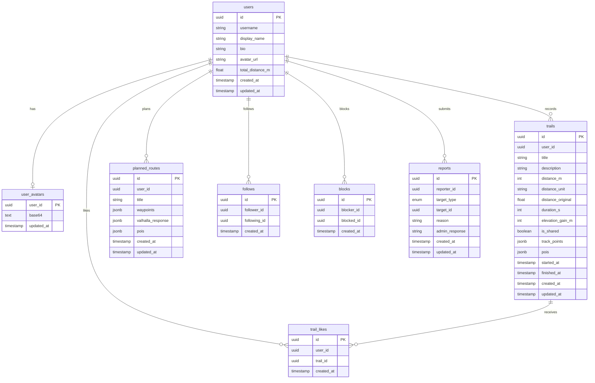

# Entity Relation Diagram

View entity relations in Mermaid Live editor [in browser](https://mermaid.live/edit#pako:eNqlVcFuozAQ_RXL57RKQpImXHdve9nzKhKawIS4MTayh7TZNP--NoYWKOm2qoSQ_eaNZ-bNYC481RnymKP5KSA3UGwVY5VFY9nFL92mEhlzz-9fYW_JCJWzTNhSwjlRUGDPsBO6t4cTEJikMjLAe6mBGGkCmbhDCFSKSRFsJAp0SFGy1CAQZgnQ0FKVWcdy3ao24yRE6ideGzrZEz4T24HF1eJTB5MBIW9q0Q3RK5oEyb4sGdrUiJKEVgEXitiw_jdtA1wpQV3VXg3aiFwokJ2jKgP-8MS-YSjxFMAchGqD7LSWCIoJm9gDGGwyf7Ra7Xy96TEptXO3XdwhdiiYe5vxHu2FEvYwavpiY2v9EymO-IUm1EjwbKFbCTRh3Cgr5UCjK8JvtTvI9QTn9xqeQB5ASkgM2lIri_8T-Ita7bWU-unj7ANnqFVAXSWf1WsndXr8OFJNGQYKYPbZMAZLbejjOIHTCYSqKpgbzRwpoXOJ3ZkI6KB7LrJtv8r20soK98H0-_Sty8myl5e7O31pL5SYbbnBVJvMbvk4qZl6z6xXI7zB2Hqqh8ao7XB4TrMeYTV99aSwHOG0TfEkW-0KQe9ZL_0b2VMP0NAaBW6U6kRBcQrVbhWf8NyIjMdkKpzwAk0BfsvridhyOqD7_XDvmIE5eqer8ylB_dG6aN2cPPmBx3uQ1u1Cj5rf3SsFVYbmh64U8Xi5eqjP4PGFP_P4br6M7qN1NJ3NHjbL6Wa-XE342eHr6H4erRy-XkTRcrO-TvjfOuzsPppN54vpOorWm9VisYmu_wAR9Ydn).

