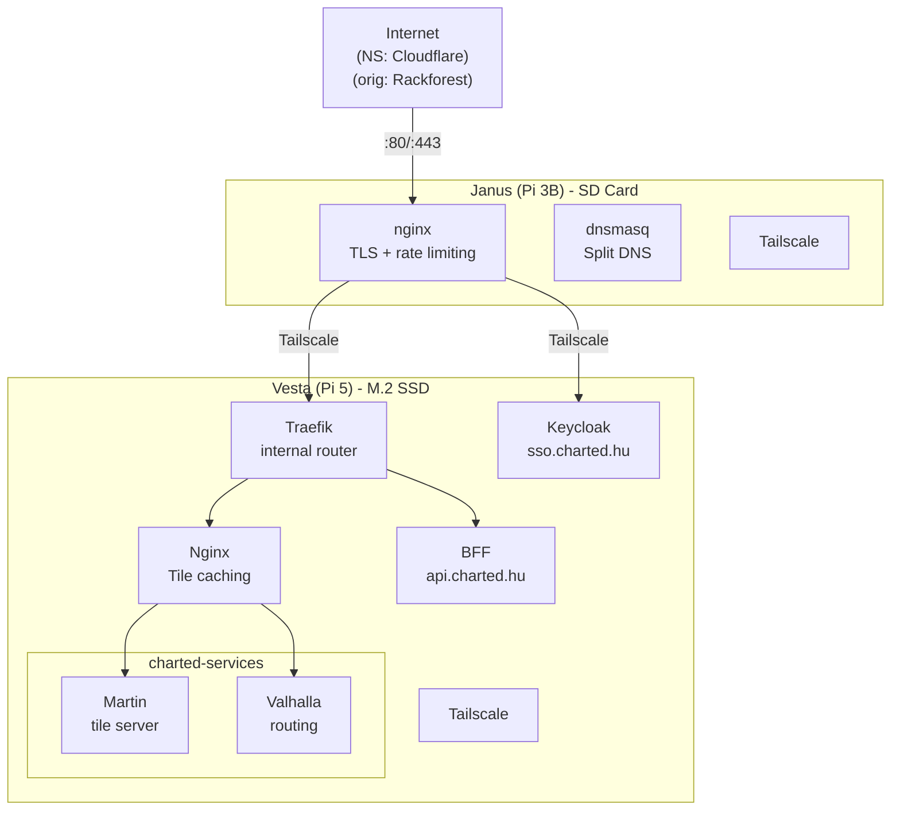

## (Archive) Network Diagram

Prototype network diagram.

View old diagram in Mermaid Live editor [in browser](https://mermaid.live/edit#pako:eNqFU8GO2jAQ_RXLp0WFlIR4CT70sKCVuu2iVYM4tK5WbmISC8ehTtLuFvj3jkMSCFupcyDPw3vjmTfJHkd5LDDFG5X_jlJuSrRaMP1Rl8JoUX5juIWM6ZtlSNFc5VW8UdyIgU3lRiYUfeHRdpMbUZQDhr8zzTSCKKofieG7FD1wXRVQq36imyeJJncDNELhAs25iWsJakInUr88ALkGcMXqc4jeIcNLgZTMZCl10hPEush48RMUDQJNuFOyRItl2GOuuFRFxJV4tvW7U8cROn7T-hpm4sCun3XrxHb-6HgoDBf98oaLjdza0icEjcjaPa6QyStAPf4n8RqpnFtBC0FRFLlTL0LETlr1BEvryBroy9YaqQSKeJRee9LN9mbOM6cbsbntuRDml4yEXVSTGrWpXnEbj_C_1MA8AeiltL1Y_tWUNtZcpVyp2scGgsJact34xQps3N3fgwZ-gc538l_GXCjaVxWNRh8ODNNg_J76_oThQ_NWnWgn3JAu3Dm0G_wfrduWvli7JTYbepu3E-jzCutc49x1ujNI4yFOjIwxLU0lhjgTJuP2iPdWxHCZigz6oQBjbrYMM30EzY7rr3metTJwOUkx3XBVwKnaxfAhLSSH1Z8p4KEw87zSJaazugKme_yCqet6TkDIlBASkMD1Zu4Qv2I6GU-d6SwIfN-bEOL7t7fHIf5TXzp2ggkZu2RGPBJMXW8aHP8CLP1iHQ).

