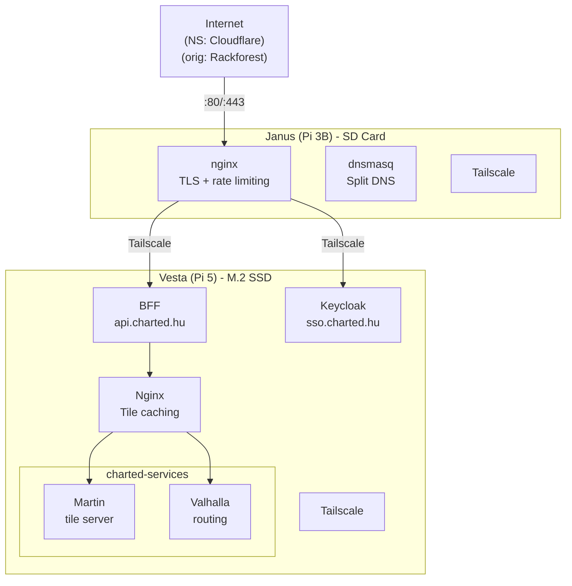

# Network Diagram

The actual network diagram.

View diagram in Mermaid Live editor [in browser](https://mermaid.live/edit#pako:eNqFUtFu2jAU_RXLT0WDjIS4BD_soaBK61ZULYiHzVPlJSax6tjMSbZ2wL_vOiQpFE3zQ3x8c871ved6hxOTCkzxRpnfSc5thVYLpj_qSlgtqm8Md5AxfbWMKZorU6cbxa0YuJCxMqPoC0-eNsaKshow_J1pphGssv6RWb7N0R3XdQm5mh1dPUg0uRmgEYoXaM5t2khQu3Qm9fMdkBsAV6w-x-gdsrwSSMlCVlJnZ4JUlwUvf4KiRaCJt0pWaLGMz5grLlWZcCUeXf7-1HOETi9KX0NPHNjN3pROXOX3XoDieHGW_ub2FojwhQL4VnqNnSL18vqM9km8JMrwJ-B2EARlaf4lWDoj1kBfdo5IJVDCk_ytFX1LF-29cvrO2tseS2F_yUS4-bShURc6S-7WPfyXGphHALVUrhbHF_aCveYq50o19rUQFNbUFzM8cf4Edk8PjUYf9gzTaPyehuGE4X37So60I25JJ23v3UT-R-lHoNsROlJr-TF2xE247fptuG9O4yHOrEwxrWwthrgQtuDuiHdOxHCViwKupQBTbp8YZvoAmi3XX40pOhk4lOWYbrgq4VRvU3j7C8lhbK8UsEnYual1hSlpMmC6w8-Y-n7gRYRMCSERifxg5g_xC6aT8dSbzqIoDIMJIWF4fX0Y4j_NpWMvmpCxT2YkINHUD6bR4S_5Kkgl).

